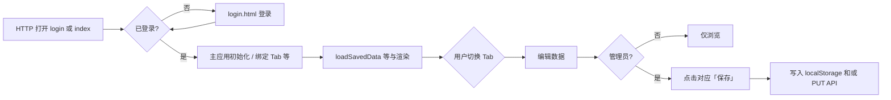
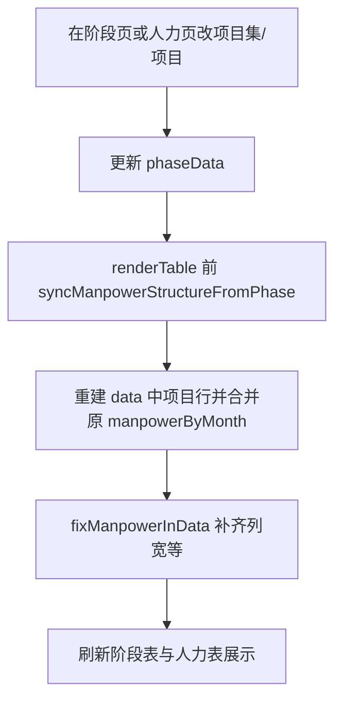

# 产品需求文档（PRD）

**产品名称**：项目管理登记（Web 工具）  
**文档版本**：1.2  
**对应代码库**：前端 [`frontend/index.html`](../frontend/index.html)（主应用）、[`frontend/login.html`](../frontend/login.html)（登录页）；后端 [`backend/`](../backend/)（FastAPI + SQLite + 会话鉴权）  
**文档说明**：本文档基于当前代码实现梳理，用于产品对齐、验收与迭代规划。

---

## 1. 产品概述

### 1.1 产品定位

面向项目管理场景的 **浏览器端登记与查看工具**，将项目阶段状态、部门人力、风险与 PM 操作指引集中在一套界面中。**需先通过服务端登录**；**管理员 / 普通用户** 由 **登录账号在数据库中的角色** 决定（不再在设置里本地切换身份）。

**持久化（当前实现）**：

- **浏览器端**：人力、阶段、风险、列宽、操作指引等仍可通过 **`localStorage`** 保存在本机浏览器（与早期单机版行为一致）。  
- **服务端**：**FastAPI** 提供 **会话 Cookie 鉴权**（`POST /api/v1/auth/login` 等），并对 **项目阶段状态、部门项目人力登记、项目风险登记** 提供 **REST 接口** 读写 **SQLite**（`backend/data/app.db`）。**GET** 需登录；**PUT** 仅 **管理员**。前端主流程在启动时请求当前用户；未登录跳转 `login.html`。

适合本机或内网「静态页 + API」部署、轻量台账，以及需要 **账号级权限** 的小团队用法。

### 1.2 目标用户

| 角色 | 说明 |
|------|------|
| **管理员** | 登录账号角色为 `admin`：可维护项目树、部门结构、各页登记数据与指引内容，可执行各页「保存」；可在 **设置 → 人员账号** 中维护用户列表（与后端 `/api/v1/users` 一致）。 |
| **普通用户（查看者）** | 登录账号角色为 `viewer`：可浏览各页数据与指引、打开分析图表；不可编辑登记数据、不可保存、不可管理用户。 |

### 1.3 核心价值

- **统一入口**：阶段、人力、风险、指引、设置多 Tab 切换。  
- **项目主数据以阶段表为准**：项目集/项目名称与层级由「项目阶段状态」维护，「部门项目人力登记」自动对齐结构并保留人力历史（按规则合并）。  
- **按时间维度看人**：人力支持月度录入、季度/年度汇总视图。  
- **轻量分析**：人力月度分析、风险分析（Chart.js 图表）。  
- **可扩展预留**：项目阶段状态分析弹窗已占位，便于后续接入 AI 等能力。

---

## 2. 用户故事

### 2.1 项目阶段状态

- **US-P1**：作为管理员，我希望按 **年、月** 为每个子项目填写阶段目标、交付、亮点、不足与下阶段注意事项，以便按月复盘。  
- **US-P2**：作为管理员，我希望在阶段页 **新增/重命名/删除** 项目集与子项目，以便项目树与真实项目一致。  
- **US-P3**：作为普通用户，我希望只读查看阶段表，以便了解登记内容但无法误改。  
- **US-P4**：作为用户，我希望点击「项目阶段状态分析」打开分析界面，以便未来查看基于登记内容的结论（当前为占位）。

### 2.2 部门项目人力登记

- **US-M1**：作为管理员，我希望在 **月度** 视图下按部门列录入各项目人力（0–99），以便做当月台账。  
- **US-M2**：作为管理员，我希望维护 **一级部门分组与二级部门列**，以便表头与业务组织一致。  
- **US-M3**：作为管理员，我希望项目集/项目 **与阶段表自动同步**，我只在阶段表维护结构，人力表展示同名同行，以便避免两套项目树不一致。  
- **US-M4**：作为用户，我希望查看 **季度、年度** 汇总，以便快速浏览非当月维度。  
- **US-M5**：作为用户，我希望打开「项目月度人力分析」查看图表，以便了解当月人力分布与排行。

### 2.3 项目风险登记

- **US-R1**：作为管理员，我希望登记每条风险的 **项目、登记时间、登记人、说明、评估、等级、状态、预计解除时间**，以便风险台账完整。  
- **US-R2**：作为管理员，我希望按表头对列 **排序**，以便快速查找与汇报。  
- **US-R3**：作为用户，我希望打开「项目风险分析」查看状态分布与分组统计图，以便例会展示。

### 2.4 PM 操作指引

- **US-G1**：作为管理员，我希望在 **产品设计 / 技术设计 / 开发+测试 / 运营** 四个板块中 **增删改** 指引条目（标题、正文、可选链接），以便团队共享规范。  
- **US-G2**：作为用户，我希望点击标题 **打开 http(s) 链接** 或 **查看正文说明**，以便自助查阅。

### 2.5 设置与账号

- **US-S1**：作为用户，我希望通过 **登录页** 使用用户名与密码进入系统，以便与我的账号角色一致。  
- **US-S2**：作为用户，我希望在 **权限管理** 中查看当前账号与 **各菜单在管理员/普通用户下的能力说明**，以便理解可操作范围。  
- **US-S3**：作为 **管理员**，我希望在 **人员账号** 中 **增删改** 用户（用户名、初始密码、角色、启停），以便团队账号可维护；系统需保护 **最后一名活跃管理员** 不被误删或降级。  
- **US-S4**：作为用户，我希望使用 **退出登录** 清除会话并返回登录页，以便在共享电脑上安全离开。

---

## 3. 核心功能说明

### 3.1 全局与导航

| 功能 | 描述 |
|------|------|
| 登录与门禁 | 使用 **`frontend/login.html`** 登录；主应用 **`index.html`** 启动时请求 **`GET /api/v1/auth/me`**（携带 Cookie）；未登录（401）跳转登录页。认证不可达或长时间无响应时，前端有 **超时与降级**（可按实现进入仅本地数据的只读模式，详见技术设计文档）。 |
| 顶部 Tab | 项目阶段状态、部门项目人力登记、项目风险登记、PM 操作指引、设置。 |
| 权限门禁 | `window.pmIsAdmin()` 由 **当前登录用户** 的 `role`（`admin` / `viewer`）驱动；多处 `requireAdminOrAlert()` 拦截写操作。 |
| 保存粒度 | 人力、风险、阶段 **分按钮保存**。默认写入 **不同 localStorage 键**；指引使用 `pmGuideData`。调用 **PUT `/api/v1/manpower|phase|risk`** 时需 **管理员** 且携带有效会话。 |
| 退出 | 导航栏与设置内 **退出登录**：通知服务端 `POST /api/v1/auth/logout`（不阻塞跳转），并进入 `login.html`。 |
| 工程布局 | **`frontend/index.html`**、**`frontend/login.html`**；根目录 `README.md`、`package.json`、`docs/`。 |

### 3.2 项目阶段状态

- **时间选择**：年（数字输入）、月（下拉）。  
- **表格结构**：项目集（行合并）+ 项目 + 多列文本字段（多行输入框）。  
- **字段（按年月切片存 `phaseByMonth`）**：项目阶段目标、项目阶段交付、阶段工作亮点、阶段工作不足、下一阶段注意事项。  
- **结构维护（管理员）**：新项目集、子项目、改名、删除（与人力表共用删除确认弹窗逻辑，数据以 `phaseData` 为准）。  
- **持久化（浏览器）**：`PM-tool-phase-v1`。**服务端**：`PUT/GET /api/v1/phase`（载荷 `{ phaseData, savedAt? }`），详见技术设计文档。  
- **阶段分析**：工具栏按钮打开模态框，展示当前所选年月说明；正文预留 AI 分析文案。

### 3.3 部门项目人力登记

- **子视图**：月度（默认）、季度、年度。  
- **月度**：年、月、部门多级表头；单元格人数编辑（失焦保存到内存，需点「保存」写入 localStorage）。  
- **部门结构**：部门分组 + 每组下多列；支持增删列/组（需在月度上下文校验）。  
- **与阶段表同步**：`syncManpowerStructureFromPhase()` — 以 `phaseData` 为权威；同项目集内项目数一致时 **按下标** 合并 `manpowerByMonth`，否则 **按项目名称** 匹配旧行；多出的项目人力为空/零。  
- **无阶段存档时**：从已加载的人力数据生成阶段表骨架（仅名称，`phaseByMonth` 空），再同步，兼容旧数据。  
- **列宽**：月度注册表列宽可拖拽调整，持久化 `PM-tool-register-colwidths-v1`。  
- **分析**：「项目月度人力分析」— 项目集占比饼图、各集内子项目占比、子项目排行条形图（Chart.js）。  
- **持久化（浏览器）**：`PM-tool-manpower-v1`（含 `data`、`deptGroups`）。**服务端**：`PUT/GET /api/v1/manpower`（载荷 `{ data, deptGroups, savedAt? }`）。  

### 3.4 项目风险登记

- **字段**：项目、风险登记时间、风险登记人、风险说明、风险评估、风险等级（低/中/高/极高）、目前状态、预计解除时间（日期控件）。  
- **交互**：表头排序（升序/降序切换）；删除确认。  
- **分析**：目前状态饼图；按「风险评估」等规则分组条形图，支持按数量/按组内最高等级排序。  
- **持久化（浏览器）**：`PM-tool-risk-v1`。**服务端**：`PUT/GET /api/v1/risk`（载荷 `{ riskRows, savedAt? }`）。  

### 3.5 PM 操作指引

- **板块**：产品设计（design）、技术设计（techDesign）、开发+测试（develop）、运营（operate）。  
- **条目字段**：标题（必填）、说明正文、链接（可选，限 http/https）。  
- **交互**：管理员「+ 添加指引」、编辑/删除；普通用户仅查看。点击标题：有合法外链则新标签打开，否则详情弹窗展示正文。  
- **持久化**：`pmGuideData`（JSON）。

### 3.6 设置

- **权限管理**：展示 **当前登录用户名与角色**（管理员/普通用户）说明文案；功能菜单权限说明表（阶段、人力、风险、指引、设置）。  
- **人员账号**（仅管理员可见）：调用后端用户接口，支持创建用户、调整角色与状态等；普通用户见占位说明。  
- **退出登录**：与会话清除、跳转登录页一致（见 3.1）。  
- **通用设置**：占位模块，预留扩展。  
- **持久化**：`PM-tool-app-settings-v1` 仍可用于本地通用项；**登录角色不以 localStorage 切换为准**，以服务端会话与 `/auth/me` 为准。

### 3.7 数据迁移与兼容

- 若存在旧键 `PM-tool-data-v1` 且无新键，会迁移为人力+风险存储并删除旧键（逻辑见 `loadSavedData`）。

---

## 4. 业务流程

### 4.1 主流程：从打开页面到登记与保存

说明：保存默认仍以 **localStorage** 为主；**PUT** 业务 API 需 **管理员 + Cookie**（详见技术设计文档）。

### 4.2 项目树变更（阶段表为权威）

### 4.2.1 阶段表保存（管理员）

1. 在「项目阶段状态」编辑文字或结构后，点击 **「保存」**。  
2. 默认写入浏览器 **`PM-tool-phase-v1`**；若前端已对接后端，可同时或改为 **`PUT /api/v1/phase`**。

### 4.3 人力月度编辑

1. 切换到「部门项目人力登记」—「月度」。  
2. 选择年、月（与内存中 `manpowerSelYear/Month` 绑定）。  
3. 点击单元格输入 0–99，失焦写回 `data` 并 `renderTable`。  
4. 点击「保存」将 `data` 与 `deptGroups` 写入浏览器存储键 `PM-tool-manpower-v1`（若已对接后端，可同时或改为 `PUT /api/v1/manpower`）。

### 4.4 风险登记与排序

1. 管理员「+ 新增风险」生成一行（含默认登记时间等）。  
2. 填写各字段；表头点击切换排序键与方向。  
3. 「保存」前从 DOM 同步回 `riskRows`，再写入 `PM-tool-risk-v1`（若已对接后端，可同时或改为 `PUT /api/v1/risk`）。

### 4.5 指引维护

1. 管理员在对应板块「+ 添加指引」或编辑。  
2. 校验标题与链接格式。  
3. 写入 `guideData` 并 `saveGuideData()`，刷新列表。

### 4.6 登录、角色与退出

1. 打开 **`login.html`**，输入用户名与密码，登录成功后进入 **`index.html`**（会话写入 Cookie `pm_session`，具体见技术设计文档）。  
2. 主应用根据 **`/auth/me`** 返回的 `role` 设置 `appUserRole` 与 `window.pmIsAdmin()`，刷新各页按钮禁用状态。  
3. **管理员** 可在 **设置 → 人员账号** 维护用户；**普通用户** 仅查看权限说明。  
4. 点击 **退出登录** 结束会话并返回登录页。

---

## 5. 数据模型摘要

### 5.1 浏览器（localStorage）

| 存储键 | 内容摘要 |
|--------|----------|
| `PM-tool-manpower-v1` | `data`（项目集→项目→`manpowerByMonth` / 当前月 `manpower` 指针）、`deptGroups` |
| `PM-tool-phase-v1` | `phaseData`（项目集→项目→`phaseByMonth[yyyy-MM]`→五字段文本） |
| `PM-tool-risk-v1` | `riskRows` 数组 |
| `PM-tool-app-settings-v1` | 通用设置等（**不用于切换登录角色**） |
| `PM-tool-register-colwidths-v1` | 月度表列宽 |
| `pmGuideData` | 四板块条目列表 |

### 5.2 服务端（SQLite，`registry` 文档表）

| 逻辑键 | HTTP | 载荷（与上表 JSON 结构对齐） |
|--------|------|------------------------------|
| `manpower` | `GET`/`PUT` `/api/v1/manpower` | `{ data, deptGroups, savedAt }` |
| `phase` | `GET`/`PUT` `/api/v1/phase` | `{ phaseData, savedAt }` |
| `risk` | `GET`/`PUT` `/api/v1/risk` | `{ riskRows, savedAt }` |

**用户表（SQLite `users`）**：登录账号、密码哈希、角色、是否启用等；首次启动种子用户 **Sky**（初始密码见环境变量说明，默认 `123123`）。

**单租户 MVP**：`registry` 全局各类型一条快照；已支持 **多登录账号** 与 **管理员维护用户**，无多工作区隔离（可后续扩展）。

---

## 6. 非功能需求（基于现状）

| 类别 | 说明 |
|------|------|
| 运行环境 | 现代浏览器；需联网加载 Chart.js CDN。使用登录与 API 时，前端须通过 **HTTP(S)** 访问（勿依赖 `file://`），以便 **Cookie 会话** 生效。 |
| 后端 | Python 3 + FastAPI；SQLite 于 `backend/data/`；**会话密钥** `PM_SESSION_SECRET` 生产必填；CORS 见 `PM_CORS_ORIGINS`（默认含常见本机静态端口如 5500、3000）。 |
| 安全 | **基于 Cookie 的会话**；业务 **GET 需登录**，**PUT 需管理员**。`PM_AUTH_DISABLED=true` 仅本地调试。链接 `noopener`；指引链接限 http/https。 |
| 容量 | localStorage 受浏览器配额限制；服务端受磁盘与 SQLite 单文件规模限制。 |
| 多设备 | 浏览器存储不跨设备；同一后端 + 登录账号可共享服务端 `registry` 快照（单租户全局数据）。 |
| 无障碍 | 部分 Tab、表格具备 `role`/`aria-*`；未完整审计 WCAG。 |

---

## 7. 已知限制与后续可迭代方向

1. **前端与 registry 全量对接**：主流程仍以 **localStorage** 为主；若需「打开即读库、保存即写库」，可在 Storage 抽象层统一接 API。  
2. **阶段状态分析**：界面已预留，结论生成（如 AI）未实现。  
3. **通用设置**：仅占位文案。  
4. **协作与审计**：有登录与角色，仍 **无多租户数据隔离、无操作审计日志**；生产需 HTTPS、强密钥、同源或受控跨站策略。  
5. **导出/导入**：未内置 JSON 导出导入 UI（可作为后续 PRD 条目）。  
6. **指引 / 列宽**：仍主要浏览器存储；可后续增加服务端备份接口。

---

## 8. 文档修订记录

| 版本 | 日期 | 说明 |
|------|------|------|
| 1.0 | 2026-04-11 | 初版，基于根目录单文件 `index.html` 梳理 |
| 1.1 | 2026-04-11 | 前后端分目录；补充 FastAPI + SQLite 与服务端持久化说明；前端入口改为 `frontend/index.html` |
| 1.2 | 2026-04-12 | 对齐 **登录与会话**、**服务端角色与人员账号**、**registry API 鉴权**；补充 `login.html`、退出与启动流程说明 |

---

*本文档由代码库分析生成，若实现变更请同步更新本文档。*
