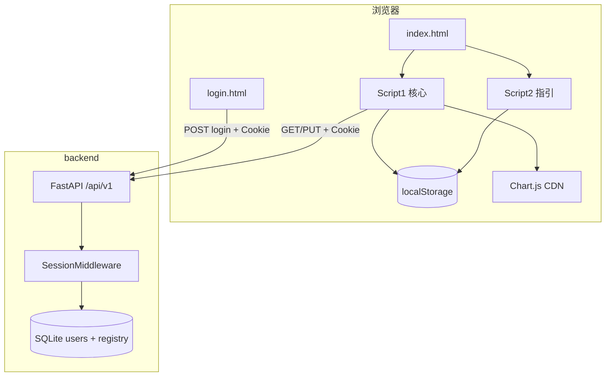
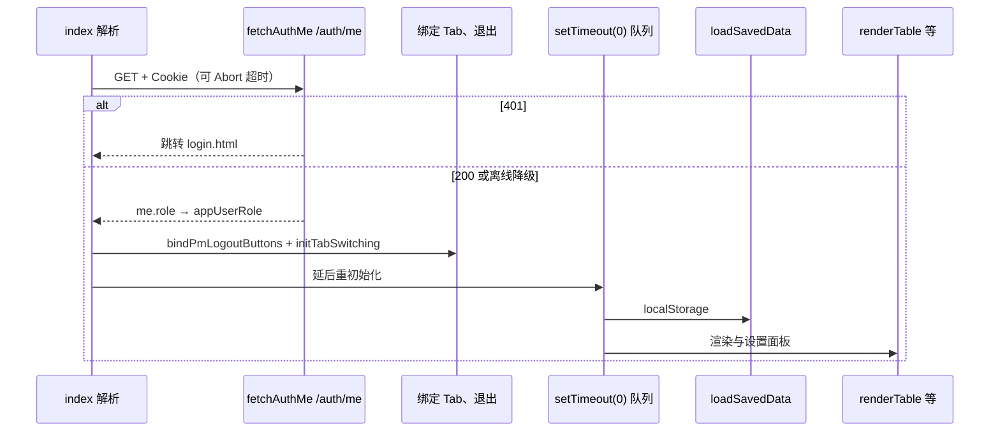

# 技术设计文档（TDD）

**项目名称**：项目管理登记（Web）  
**文档版本**：1.2  
**对应实现**：前端 [`frontend/index.html`](../frontend/index.html)、[`frontend/login.html`](../frontend/login.html)；后端 [`backend/`](../backend/)（FastAPI + SQLAlchemy + SQLite + Starlette Session + bcrypt）  
**关联文档**：[`docs/PRD-项目管理登记工具.md`](PRD-项目管理登记工具.md)

---

## 1. 架构总览

### 1.1 形态

- **前端**：无构建工具；主应用 **`frontend/index.html`**（内联 CSS + 两段 `<script>`）；**`frontend/login.html`** 独立登录页（`fetch` + `credentials: 'include'`，带超时）。  
- **鉴权**：后端 **Starlette `SessionMiddleware`**，Cookie 名 **`pm_session`**；`POST /api/v1/auth/login` 写入会话用户 id；**`get_current_user` / `require_admin`** 依赖注入保护路由。  
- **持久化（双轨）**  
  - **浏览器**：`localStorage` 为人力、阶段、风险、列宽、指引等的主要实现。  
  - **服务端**：**FastAPI** 提供 `/api/v1/manpower`、`/phase`、`/risk` 的 `GET`/`PUT`（**GET 需登录，PUT 需管理员**），JSON 与 localStorage 根对象形状一致，存入 **SQLite** 表 **`registry`**；**`users`** 表存登录账号。  
- **脚本分段（主应用）**：首段为核心与认证引导 **`pmBootstrap`**；第二段为 **PM 操作指引**（`guideData`），经 **`window.__renderGuideMenu`** 桥接。

### 1.2 交互范式（前端）

- **命令式 DOM**：`getElementById`、`createElement`、`innerHTML` 等。
- **全局可变状态**：`data`、`phaseData`、`riskRows`、`deptGroups` 等。
- **权限门面**：`window.pmIsAdmin()` 由 **`appUserRole`** 驱动；该值在 **`fetchAuthMe` → `/auth/me`** 成功后与 **`me.role`** 同步（`admin` / `viewer`）。
- **启动顺序（摘要）**：`pmBootstrap`：`await fetchAuthMe()`（含 **Abort 超时**，避免 `/auth/me` 永久挂起）→ 绑定退出按钮 → **尽早**注册 Tab 切换与删除弹窗键盘无障碍 → **`setTimeout(0)`** 再执行 `loadSavedData`、各 `init*Ui`、渲染与设置面板，避免长同步阻塞点击。
- **API 基址**：`window.PM_API_BASE` 或默认 `http://127.0.0.1:8001`；`pmFetch` 统一 `credentials: 'include'`。

### 1.3 仓库目录（摘要）

| 路径 | 说明 |
|------|------|
| `frontend/index.html` | 主页面 |
| `backend/app/` | FastAPI 应用、路由、ORM、配置 |
| `backend/data/` | SQLite 数据目录（`app.db` 通常不入库） |
| `docs/` | PRD、TDD、操作指南 |
| 根目录 `README.md` / `package.json` | 启动说明、可选 `npm run dev` |

---

## 2. 技术栈

| 类别 | 选型 | 说明 |
|------|------|------|
| 前端运行时 | 现代浏览器（ES5+ 风格脚本） | 无 TypeScript/Babel |
| 标记与样式 | HTML5 + 内联 `<style>` | CSS 变量、Flex/Grid |
| 图表 | [Chart.js](https://www.chartjs.org/) 4.4.1 UMD | CDN |
| 前端持久化 | `localStorage` | 多 Key JSON |
| 后端 | Python 3、**FastAPI**、**Uvicorn** | ASGI |
| ORM / DB | **SQLAlchemy 2**、**SQLite** | `users` + `registry` |
| 会话 / 密码 | **Starlette SessionMiddleware**、**bcrypt** | Cookie 会话；密码哈希 |
| 校验 / 配置 | **Pydantic v2**、**pydantic-settings** | 请求体验证、CORS、`PM_*` 环境变量 |
| 网络 | 前端 `fetch` + `credentials: 'include'` | CORS `allow_credentials=True`；勿使用 `file://` |

---

## 3. 模块划分

### 3.1 前端（逻辑模块）

| 模块 | 主要职责 | 代表性符号 / DOM |
|------|----------|------------------|
| **布局与导航** | Tab、面板 | `.tabs`、`.tab-panel`、`initTabSwitching` |
| **项目阶段状态** | `phaseData`、渲染与保存 | `renderPhaseTable`、`savePhaseData` |
| **部门项目人力** | `data`、`deptGroups`、同步 | `renderTable`、`syncManpowerStructureFromPhase`、`saveManpowerData` |
| **项目风险** | `riskRows` | `renderRiskTable`、`saveRiskData` |
| **分析 UI** | 人力/风险/阶段（占位）弹窗与 Chart | `openManpowerAnalysisModal` 等 |
| **设置与权限** | `initSettingsPanelOnce`、`updateSettingsPanelRoleUi`、`refreshUsersTable`（管理员） | 无本地「切换角色」；角色来自登录态 |
| **认证** | `fetchAuthMe`、`pmLogout`、`pmBootstrap` | `login.html` 独立页面 |
| **指引（脚本 2）** | `guideData`、`renderGuideMenu` | `window.__renderGuideMenu` |

### 3.2 后端（物理模块）

| 路径 | 职责 |
|------|------|
| `app/main.py` | `lifespan`：`init_db` + **`seed_users`**；**`CORSMiddleware`**（先于 Session 注册顺序见代码）、**`SessionMiddleware`**、挂载路由、`GET /health` |
| `app/config.py` | `PM_CORS_ORIGINS`、`PM_SESSION_SECRET`、`PM_SESSION_SAME_SITE`、`PM_SESSION_HTTPS_ONLY`、`PM_SKY_INITIAL_PASSWORD`、`PM_AUTH_DISABLED` 等 |
| `app/db.py` | Engine、`SessionLocal`、`init_db` |
| `app/models.py` | **`User`**；**`RegistryEntry`**（`key` + JSON `payload`） |
| `app/schemas.py` | `ManpowerState`、`PhaseState`、`RiskState`、登录与用户 CRUD 模型 |
| `app/security.py` | `hash_password` / `verify_password`（bcrypt） |
| `app/deps.py` | **`get_current_user`**、`require_admin`；`SESSION_UID_KEY` |
| `app/seed.py` | 首次创建默认管理员 **Sky**（密码见 `PM_SKY_INITIAL_PASSWORD`，默认 `123123`） |
| `app/registry_store.py` | `get_json` / `put_json` |
| `app/routers/auth.py` | `POST /login`、`POST /logout`、`GET /me` |
| `app/routers/users.py` | 用户列表/创建/更新/删除（**管理员**；保护最后一名活跃管理员） |
| `app/routers/manpower.py` 等 | `GET`：`CurrentUser`；`PUT`：`AdminUser` |

---

## 4. 核心数据结构与状态（前端）

（与 v1.0 一致，节选）

| 变量 | 含义 |
|------|------|
| `data` | 人力项目树 + `manpowerByMonth` / 当前月 `manpower` |
| `phaseData` | 阶段树 + `phaseByMonth[yyyy-MM]` |
| `deptGroups` | 部门分组与列 |
| `riskRows` | 风险行数组 |
| `appUserRole` | `admin` / `viewer` → `window.pmIsAdmin` |

**权威约定**：项目集/子项目以 **`phaseData`** 为准；`renderTable()` 起始 `syncManpowerStructureFromPhase()`。

---

## 5. 关键数据流

### 5.1 应用启动（前端）

未登录用户应通过 **`login.html`** 完成 `POST /auth/login` 后再访问 `index.html`。

### 5.2 保存三类登记（当前默认）

1. `saveManpowerData` / `savePhaseData` / `saveRiskData` → `localStorage`。  
2. **对接后**：同一函数内或包装层增加 `PUT /api/v1/manpower|phase|risk`，`Content-Type: application/json`，body 与现有保存对象一致。

### 5.3 后端处理单次写入

1. Pydantic 校验 body。  
2. `put_json`：合并服务端 `savedAt`（ISO），`UPDATE`/`INSERT` `registry`。  
3. 返回存储后的 JSON。

---

## 6. API 设计

### 6.1 后端 HTTP API（已实现）

Base URL 示例：`http://127.0.0.1:8001`

| 方法 | 路径 | 请求体 / 响应 | 鉴权 | 说明 |
|------|------|----------------|------|------|
| `GET` | `/health` | `{ "status": "ok" }` | 无 | 健康检查 |
| `POST` | `/api/v1/auth/login` | Body：`{ username, password }`；响应：`{ username, role }` | 无 | 建会话；用户名匹配 **不区分大小写** |
| `POST` | `/api/v1/auth/logout` | `{ "ok": true }` | Cookie | 清会话 |
| `GET` | `/api/v1/auth/me` | `{ id, username, role }` | Cookie | 当前用户 |
| `GET` | `/api/v1/users` | `UserOut[]` | **管理员** | 用户列表 |
| `POST` | `/api/v1/users` | `UserCreate` | **管理员** | 创建用户 |
| `PATCH` | `/api/v1/users/{id}` | `UserUpdate` | **管理员** | 更新；不可动最后一名活跃管理员 |
| `DELETE` | `/api/v1/users/{id}` | — | **管理员** | 删除；同上保护 |
| `GET` | `/api/v1/manpower` | `{ data, deptGroups, savedAt? }` | **已登录** | 无记录时返回空结构 |
| `PUT` | `/api/v1/manpower` | 同上 | **管理员** | 覆盖快照 |
| `GET` | `/api/v1/phase` | `{ phaseData, savedAt? }` | **已登录** | |
| `PUT` | `/api/v1/phase` | 同上 | **管理员** | |
| `GET` | `/api/v1/risk` | `{ riskRows, savedAt? }` | **已登录** | |
| `PUT` | `/api/v1/risk` | 同上 | **管理员** | |

`PM_AUTH_DISABLED=true` 时 **`get_current_user`** 返回占位管理员，用于本地调试（**禁止生产**）。

OpenAPI：`/docs`（Swagger UI）。

**CORS**：`allow_credentials=True`；默认 origin 含 `127.0.0.1:3000`、`5500`、`8080` 等；**`PM_CORS_ORIGINS`** 逗号分隔覆盖，见 [`backend/app/config.py`](../backend/app/config.py)。

**Cookie**：`PM_SESSION_SAME_SITE`（默认 `lax`）、`PM_SESSION_HTTPS_ONLY`；跨站场景见根目录 [`README.md`](../README.md)。

### 6.2 浏览器持久化（前端仍使用）

| 键名 | 载荷形状（摘要） |
|------|------------------|
| `PM-tool-manpower-v1` | `{ data, deptGroups, savedAt }` |
| `PM-tool-phase-v1` | `{ phaseData, savedAt }` |
| `PM-tool-risk-v1` | `{ riskRows, savedAt }` |
| `PM-tool-app-settings-v1` | 通用设置等（**登录角色不依赖本键切换**） |
| `PM-tool-register-colwidths-v1` | 列宽 |
| `pmGuideData` | 指引四板块 |
| `PM-tool-data-v1` | LEGACY，迁移后删除 |

### 6.3 跨脚本桥接（前端）

| 接口 | 说明 |
|------|------|
| `window.pmIsAdmin()` | 权限判断 |
| `window.__renderGuideMenu` | 刷新指引面板 |

### 6.4 关键内部函数（前端节选）

| 函数 | 作用 |
|------|------|
| `syncManpowerStructureFromPhase()` | 以阶段表对齐人力 `data` |
| `loadSavedData()` | 从 localStorage 灌入内存 |
| `requireAdminOrAlert()` | 写操作门禁 |

---

## 7. UI 与事件边界

- Tab / 子 Tab / 模态框 / Chart 生命周期与 v1.0 描述一致。

---

## 8. 安全与健壮性

- **前端**：`escapeHtml`、指引链接校验、`save*` 异常提示；`login.html` 对登录请求 **超时**；`renderRiskTable` 对缺失 `tbody` 做保护；`pmLogout` **不阻塞**于登出接口再跳转。  
- **后端**：会话签名密钥 **`PM_SESSION_SECRET`** 生产必填；业务写接口 **管理员** 校验；用户模块保护 **最后一名活跃管理员**。  
- **SQLite**：单文件，注意备份与并发写入规模（MVP 单机足够）。  
- **部署**：生产建议 **HTTPS + 同源或受控跨站**；谨慎使用 `PM_AUTH_DISABLED`。

---

## 9. 扩展与演进建议

1. **前端**：`StorageAdapter` 抽象 —— `LocalStorageAdapter` / `ApiAdapter`，统一人力阶段风险的读写在一点切换。  
2. **构建**：ES modules + 打包，便于测试与类型。  
3. **后端**：多租户、可选 JWT、PostgreSQL、指引与设置的 API。  
4. **阶段分析**：异步任务或外部 AI 服务。

---

## 10. 文档修订记录

| 版本 | 日期 | 说明 |
|------|------|------|
| 1.0 | 2026-04-11 | 初版，仅根目录单文件 + localStorage |
| 1.1 | 2026-04-11 | 补充 `frontend/`、`backend/`、REST API、SQLite、`registry` 表与双轨持久化 |
| 1.2 | 2026-04-12 | **会话鉴权**、`login.html`、`auth`/`users` 路由、**registry GET/PUT 权限**、中间件与启动顺序、`pmBootstrap` 行为摘要 |

---

*实现变更时请同步更新本文档与 PRD。*
