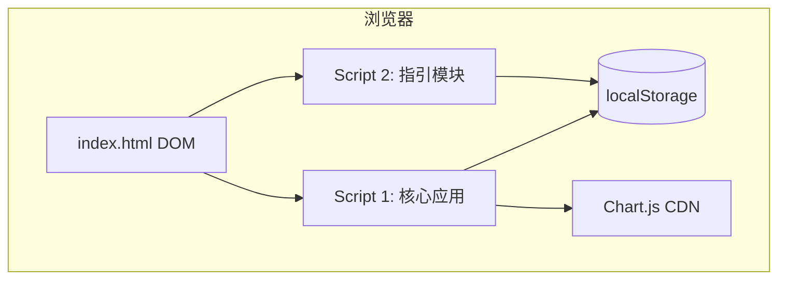
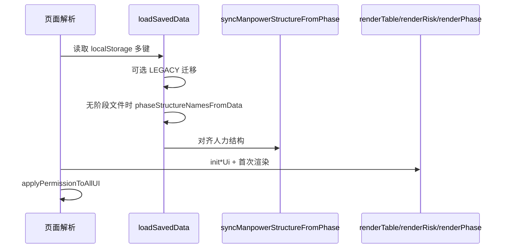

# 技术设计文档（TDD）

**项目名称**：项目管理登记（单机 Web）  
**文档版本**：1.0  
**对应实现**：仓库根目录 `index.html`（单文件，内联 CSS + 两段 `<script>`）  
**关联文档**：`docs/PRD-项目管理登记工具.md`

---

## 1. 架构总览

### 1.1 形态

- **单页应用（SPA）**：无构建工具、无模块化打包；所有 UI、样式与业务脚本集中在 **`index.html`**。
- **无应用后端**：不发起 `fetch`/XHR；业务状态驻留内存，持久化仅依赖 **`window.localStorage`**。
- **脚本分段**：首段 `<script>` 承担主体业务（人力、阶段、风险、设置、图表等）；紧随其后的第二段 `<script>` 维护 **PM 操作指引**（`guideData`），并通过 **`window.__renderGuideMenu`** 与首段桥接。

### 1.2 交互范式

- **命令式 DOM**：通过 `document.getElementById`、`createElement`、`innerHTML` 等更新界面；无 React/Vue 等虚拟 DOM 框架。
- **全局可变状态**：`let data`、`phaseData`、`riskRows`、`deptGroups` 等顶层变量作为单一数据源（SSOT 在阶段与人力之间有明确规则，见下文）。
- **权限门面**：`window.pmIsAdmin()` 由 `appUserRole` 驱动，在增删改、保存、指引编辑等路径统一校验。

---

## 2. 技术栈

| 类别 | 选型 | 说明 |
|------|------|------|
| 运行时 | 现代浏览器（ES5+ 风格脚本） | 无 TypeScript/Babel |
| 标记与样式 | HTML5 + 内联 `<style>` | CSS 变量主题、Flex/Grid 布局 |
| 图表 | [Chart.js](https://www.chartjs.org/) 4.4.1 UMD | `cdn.jsdelivr.net` 外链 |
| 持久化 | Web Storage API `localStorage` | JSON 序列化；多 Key 分域存储 |
| 网络 | 无自有 HTTP API | 仅 CDN 拉取 Chart.js |

---

## 3. 模块划分（逻辑视图）

虽物理单文件，可按职责划分为以下 **逻辑模块**（函数群 + 对应 DOM 区域）。

| 模块 | 主要职责 | 代表性符号 / DOM |
|------|----------|------------------|
| **布局与导航** | Tab 切换、面板显隐 | `.tabs`、`.tab-panel`、`initTabSwitching` |
| **项目阶段状态** | `phaseData`、按年月切片、表格渲染与保存 | `phaseData`、`renderPhaseTable`、`savePhaseData`、`syncPhaseFromDom` |
| **部门项目人力** | `data` + `deptGroups`、月度/季/年视图、列宽、与阶段结构同步 | `renderTable`、`fixManpowerInData`、`syncManpowerStructureFromPhase`、`saveManpowerData` |
| **结构同步** | 以 `phaseData` 为准重建 `data` 行并合并 `manpowerByMonth` | `syncManpowerStructureFromPhase`、`phaseStructureNamesFromData` |
| **项目风险** | `riskRows`、排序、表格与分析图 | `renderRiskTable`、`buildRiskAnalysisStats`、`saveRiskData` |
| **人力/风险分析 UI** | 模态框、Chart 实例生命周期 | `openManpowerAnalysisModal`、`renderManpowerAnalysisCharts`、`openRiskAnalysisModal` 等 |
| **阶段分析 UI（预留）** | 空壳弹窗 | `openPhaseAnalysisModal` |
| **设置与权限** | 角色读写、按钮禁用、说明表 | `loadAppSettings`、`setAppUserRole`、`applyPermissionToAllUI` |
| **通用弹窗** | 删除确认、焦点陷阱（部分） | `delCtx`、`confirmDelete`、`openDeleteModal` |
| **PM 操作指引（脚本 2）** | `guideData` CRUD、列表渲染、与 Script1 回调 | `renderGuideMenu`、`saveGuideData`、`window.__renderGuideMenu` |

---

## 4. 核心数据结构与状态

### 4.1 全局状态（Script 1 节选）

| 变量 | 含义 |
|------|------|
| `data` | 人力项目树：项目集 → 项目；每项目含 `manpowerByMonth`、`manpower`（当前月视图指针） |
| `phaseData` | 阶段项目树：项目集 → 项目；每项目含 `phaseByMonth[yyyy-MM]` → 五文本字段 |
| `deptGroups` | 部门分组及子列名称，决定扁平列数 `deptFlatCount()` |
| `riskRows` | 风险行数组，字段顺序由 `RISK_FIELD_ORDER` 约束 |
| `manpowerSubView` / `manpowerSelYear` / `manpowerSelMonth` 等 | 人力时间维度与选择器状态 |
| `phaseSelYear` / `phaseSelMonth` | 阶段表当前编辑年月 |
| `appUserRole` | `'admin' \| 'viewer'`，同步到 `window.pmIsAdmin` |
| `delCtx` | 删除弹窗上下文：`type` + 索引 |

### 4.2 指引数据（Script 2）

- `guideData`：对象，键为 `GUIDE_BLOCK_KEYS`（`design`、`techDesign`、`develop`、`operate`），值为 `{ id, title, body, link }[]`。
- 持久化键：**`pmGuideData`**（与 PM-tool-* 系列键名独立）。

### 4.3 权威数据源约定

- **项目集 / 子项目列表与名称**：以 **`phaseData` 为权威**；`renderTable()` 起始调用 `syncManpowerStructureFromPhase()`，将 `data` 对齐到 `phaseData` 并尽量保留原有人力按月数据（同集内等长下标对齐，否则按项目名消费匹配）。

---

## 5. 关键数据流

### 5.1 应用启动

### 5.2 人力表渲染与结构同步

1. `renderTable()` **首先**执行 `syncManpowerStructureFromPhase()`。  
2. `updateManpowerToolbarInputs()` 同步年月等控件。  
3. 按 `manpowerSubView` 分支：`syncProjectManpowerPointerToMonth()`（月度）、`renderManpowerThead*`、`render*TableBody`。  
4. 单元格编辑经 `editManpower` → `saveManpower` 写回 `data` 并再次 `renderTable()`。

### 5.3 阶段表编辑与保存

1. `renderPhaseTable()` 内 `syncPhaseRowPointer()` 绑定当前年月的 `_phaseSlice` 或等价逻辑。  
2. 文本域 `input` 直接写入当月 slice。  
3. `savePhaseData()`：`syncPhaseFromDom()` 按行顺序与 `phaseData` 扁平列表对齐写回，再 `JSON.stringify` 写入 `PM-tool-phase-v1`。

### 5.4 风险保存

1. `saveRiskData()` 调用 `syncRiskRowsFromDom()` 遍历 `#risk-table-body` 行，按 `RISK_FIELD_ORDER` 与控件顺序写回 `riskRows`。  
2. 持久化至 `PM-tool-risk-v1`。

### 5.5 删除项目集/项目

1. `showDeleteModal('set'|'project', …)` 基于 **`phaseData`** 文案确认。  
2. `confirmDelete()` 修改 **`phaseData`**，再 `renderPhaseTable()` + `renderTable()`（人力随同步函数更新）。

### 5.6 指引面板

1. 切换到 `panel-guide` 时调用 `window.__renderGuideMenu()`（若存在）。  
2. `setAppUserRole` 切换角色后也会刷新指引菜单以更新「添加」按钮显隐。

---

## 6. API 设计

### 6.1 后端 HTTP API

**本项目不提供 REST/GraphQL 等 HTTP 接口。** 若未来接入服务端，建议在独立前后端拆分后新增版本化 API（例如 `/api/v1/projects`），并与当前 localStorage 方案做迁移策略；本文档不定义具体路径。

### 6.2 浏览器持久化「契约」（逻辑 API）

以下为 **读写约定**，实现上均为 `localStorage.getItem` / `setItem` + `JSON.parse` / `JSON.stringify`。

| 键名 | 写入函数 | 载荷形状（摘要） |
|------|----------|------------------|
| `PM-tool-manpower-v1` | `saveManpowerData` | `{ data, deptGroups, savedAt }` |
| `PM-tool-phase-v1` | `savePhaseData` | `{ phaseData, savedAt }`（`phaseData` 经 `phaseDataForStorage` 剥离运行时字段） |
| `PM-tool-risk-v1` | `saveRiskData` | `{ riskRows, savedAt }` |
| `PM-tool-app-settings-v1` | `saveAppSettings` | 含 `appUserRole` 等 |
| `PM-tool-register-colwidths-v1` | `saveRegisterColWidths` | 列宽数组 |
| `pmGuideData` | `saveGuideData` | 整块 `guideData` 对象 |
| `PM-tool-data-v1` | （只读迁移） | 旧版 LEGACY；迁移后 `removeItem` |

**时间字段**：`savedAt` 多为 ISO 8601 字符串，用于排查与扩展，前端业务逻辑可不依赖。

### 6.3 跨脚本桥接（模块间「API」）

| 接口 | 类型 | 说明 |
|------|------|------|
| `window.pmIsAdmin()` | `function → boolean` | Script 1 挂载；Script 2 与内联 `onclick` 共用 |
| `window.__renderGuideMenu` | `function` | 指向 `renderGuideMenu`，供 Script 1 在 Tab 切换/改角色时调用 |

### 6.4 关键内部函数契约（节选）

| 函数 | 输入/依赖 | 输出/副作用 |
|------|-----------|-------------|
| `syncManpowerStructureFromPhase()` | `phaseData`, 当前 `data` | 覆盖 `data`；`fixManpowerInData`；`syncProjectManpowerPointerToMonth` |
| `fixManpowerInData(arr)` | `deptGroups` 列数 | 归一化各月数组长度与数值 |
| `getMonthSlice(p, y, m)` | 项目 `p` | 返回当月长度与部门列一致的人数数组 |
| `getPhaseMonthSlice(p, y, m)` | 项目 `p` | 返回当月五字段对象 |
| `loadSavedData()` | localStorage | 设置 `data`/`phaseData`/…；末尾必调同步 |
| `requireAdminOrAlert()` | `window.pmIsAdmin` | 非管理员 `alert` 并返回 `false` |
| `requireManpowerMonthViewForStructure()` | `manpowerSubView` | 非月度时拦截部门/单元格结构类操作 |

---

## 7. UI 与事件边界

- **Tab**：委托在 `.tabs` 上 `click`，根据 `data-target` 切换 `.tab-panel.active`；特定面板附带 `renderPhaseTable`、`initSettingsPanelOnce` 等刷新。
- **人力子 Tab**：`.manpower-subtab` 切换 `manpower-page-*`，调用 `renderTable()`。
- **模态框**：分析类、指引类、删除类各自独立 mask id；部分支持 Esc/点击遮罩关闭。
- **Chart.js**：打开分析弹窗时构建/销毁 `Chart` 实例，避免泄漏（各 `destroy*` 辅助函数）。

---

## 8. 安全与健壮性（实现层面）

- **XSS**：部分区域使用 `escapeHtml`；指引/动态内容仍以文本或受控属性为主，整体需防将未转义用户输入拼入 `innerHTML`（当前以表单控件值为主）。
- **链接**：`isSafeHttpUrl` 限制指引链接为 `http:`/`https:`。
- **存储失败**：`save*` 路径 `try/catch` + `alert` 提示。

---

## 9. 扩展与演进建议

1. **构建与模块化**：将单文件拆为 ES modules + 轻量打包，便于测试与类型约束（TypeScript）。  
2. **状态管理**：引入显式 store（或 Reducer 模式）减少全局 `let` 与隐式顺序依赖。  
3. **真正 API 层**：抽象 `StorageAdapter` / `RemoteApiAdapter`，便于对接后端而不改写 UI 层。  
4. **阶段分析**：在 `openPhaseAnalysisModal` 后接入异步分析服务，与 PRD 预留一致。

---

## 10. 文档修订记录

| 版本 | 日期 | 说明 |
|------|------|------|
| 1.0 | 2026-04-11 | 初版，基于当前 `index.html` 实现 |

---

*实现变更时请同步更新本文档与 PRD。*
