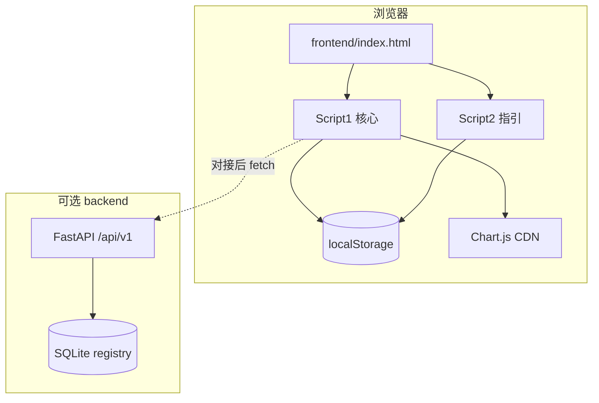
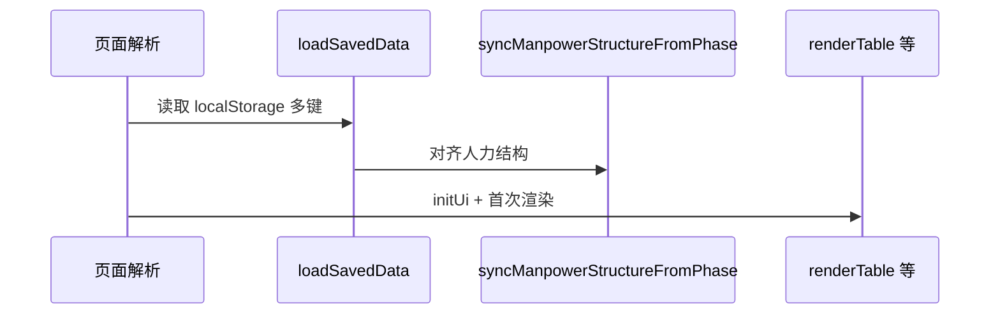

# 技术设计文档（TDD）

**项目名称**：项目管理登记（Web）  
**文档版本**：1.1  
**对应实现**：前端 [`frontend/index.html`](../frontend/index.html)（单文件，内联 CSS + 两段 `<script>`）；后端 [`backend/`](../backend/)（FastAPI + SQLAlchemy + SQLite）  
**关联文档**：[`docs/PRD-项目管理登记工具.md`](PRD-项目管理登记工具.md)

---

## 1. 架构总览

### 1.1 形态

- **前端**：无构建工具、无模块化打包；UI 与业务集中在 **`frontend/index.html`**。
- **持久化（双轨）**  
  - **浏览器**：`localStorage` 仍为人力、阶段、风险、设置、列宽、指引等的主要或默认实现。  
  - **服务端**：**FastAPI** 提供 `/api/v1/manpower`、`/api/v1/phase`、`/api/v1/risk` 的 `GET`/`PUT`，正文 JSON 与原有 localStorage 根对象一致，存入 **SQLite**（`backend/data/app.db`，表 `registry`）。
- **脚本分段（前端）**：首段 `<script>` 为核心应用；第二段维护 **PM 操作指引**（`guideData`），通过 **`window.__renderGuideMenu`** 与首段桥接。

### 1.2 交互范式（前端）

- **命令式 DOM**：`getElementById`、`createElement`、`innerHTML` 等。
- **全局可变状态**：`data`、`phaseData`、`riskRows`、`deptGroups` 等。
- **权限门面**：`window.pmIsAdmin()` 由 `appUserRole` 驱动。

### 1.3 仓库目录（摘要）

| 路径 | 说明 |
|------|------|
| `frontend/index.html` | 主页面 |
| `backend/app/` | FastAPI 应用、路由、ORM、配置 |
| `backend/data/` | SQLite 数据目录（`app.db` 通常不入库） |
| `docs/` | PRD、TDD、操作指南 |
| 根目录 `README.md` / `package.json` | 启动说明、可选 `npm run dev` |

---

## 2. 技术栈

| 类别 | 选型 | 说明 |
|------|------|------|
| 前端运行时 | 现代浏览器（ES5+ 风格脚本） | 无 TypeScript/Babel |
| 标记与样式 | HTML5 + 内联 `<style>` | CSS 变量、Flex/Grid |
| 图表 | [Chart.js](https://www.chartjs.org/) 4.4.1 UMD | CDN |
| 前端持久化 | `localStorage` | 多 Key JSON |
| 后端 | Python 3、**FastAPI**、**Uvicorn** | ASGI |
| ORM / DB | **SQLAlchemy 2**、**SQLite** | 文档表存 JSON |
| 校验 / 配置 | **Pydantic v2**、**pydantic-settings** | 请求体验证、CORS 等环境变量 |
| 网络 | 前端可 `fetch` API（对接后） | 开发期需 CORS；勿使用 `file://` 调 API |

---

## 3. 模块划分

### 3.1 前端（逻辑模块）

| 模块 | 主要职责 | 代表性符号 / DOM |
|------|----------|------------------|
| **布局与导航** | Tab、面板 | `.tabs`、`.tab-panel`、`initTabSwitching` |
| **项目阶段状态** | `phaseData`、渲染与保存 | `renderPhaseTable`、`savePhaseData` |
| **部门项目人力** | `data`、`deptGroups`、同步 | `renderTable`、`syncManpowerStructureFromPhase`、`saveManpowerData` |
| **项目风险** | `riskRows` | `renderRiskTable`、`saveRiskData` |
| **分析 UI** | 人力/风险/阶段（占位）弹窗与 Chart | `openManpowerAnalysisModal` 等 |
| **设置与权限** | `loadAppSettings`、`setAppUserRole` | |
| **指引（脚本 2）** | `guideData`、`renderGuideMenu` | `window.__renderGuideMenu` |

### 3.2 后端（物理模块）

| 路径 | 职责 |
|------|------|
| `app/main.py` | 应用实例、`lifespan` 建表、`CORSMiddleware`、挂载路由、`GET /health` |
| `app/config.py` | `PM_CORS_ORIGINS`（逗号分隔）、数据目录 |
| `app/db.py` | Engine、`SessionLocal`、`init_db` |
| `app/models.py` | `RegistryEntry`：`key` + JSON `payload` + `updated_at` |
| `app/schemas.py` | `ManpowerState`、`PhaseState`、`RiskState` |
| `app/registry_store.py` | `get_json` / `put_json`（写时刷新 `savedAt`） |
| `app/routers/manpower.py` 等 | 各资源 `GET`/`PUT` |

---

## 4. 核心数据结构与状态（前端）

（与 v1.0 一致，节选）

| 变量 | 含义 |
|------|------|
| `data` | 人力项目树 + `manpowerByMonth` / 当前月 `manpower` |
| `phaseData` | 阶段树 + `phaseByMonth[yyyy-MM]` |
| `deptGroups` | 部门分组与列 |
| `riskRows` | 风险行数组 |
| `appUserRole` | `admin` / `viewer` → `window.pmIsAdmin` |

**权威约定**：项目集/子项目以 **`phaseData`** 为准；`renderTable()` 起始 `syncManpowerStructureFromPhase()`。

---

## 5. 关键数据流

### 5.1 应用启动（前端）

对接后端后，可在 `loadSavedData` 前或内增加：**并行或优先 `GET /api/v1/*`** 合并策略（产品决定）。

### 5.2 保存三类登记（当前默认）

1. `saveManpowerData` / `savePhaseData` / `saveRiskData` → `localStorage`。  
2. **对接后**：同一函数内或包装层增加 `PUT /api/v1/manpower|phase|risk`，`Content-Type: application/json`，body 与现有保存对象一致。

### 5.3 后端处理单次写入

1. Pydantic 校验 body。  
2. `put_json`：合并服务端 `savedAt`（ISO），`UPDATE`/`INSERT` `registry`。  
3. 返回存储后的 JSON。

---

## 6. API 设计

### 6.1 后端 HTTP API（已实现）

Base URL 示例：`http://127.0.0.1:8000`

| 方法 | 路径 | 请求体 / 响应 | 说明 |
|------|------|----------------|------|
| `GET` | `/health` | `{ "status": "ok" }` | 健康检查 |
| `GET` | `/api/v1/manpower` | `{ data, deptGroups, savedAt? }` | 无记录时返回空 `data`/`deptGroups` |
| `PUT` | `/api/v1/manpower` | 同上 | 覆盖快照，`savedAt` 由服务端更新 |
| `GET` | `/api/v1/phase` | `{ phaseData, savedAt? }` | 无记录时 `phaseData: []` |
| `PUT` | `/api/v1/phase` | 同上 | |
| `GET` | `/api/v1/risk` | `{ riskRows, savedAt? }` | 无记录时 `riskRows: []` |
| `PUT` | `/api/v1/risk` | 同上 | |

OpenAPI：`/docs`（Swagger UI）。

**CORS**：默认允许常见本机静态端口；可通过环境变量 **`PM_CORS_ORIGINS`**（逗号分隔）覆盖，参见 [`backend/app/config.py`](../backend/app/config.py)。

**鉴权**：当前无；仅适合本机或可信内网。

### 6.2 浏览器持久化（前端仍使用）

| 键名 | 载荷形状（摘要） |
|------|------------------|
| `PM-tool-manpower-v1` | `{ data, deptGroups, savedAt }` |
| `PM-tool-phase-v1` | `{ phaseData, savedAt }` |
| `PM-tool-risk-v1` | `{ riskRows, savedAt }` |
| `PM-tool-app-settings-v1` | 设置含 `appUserRole` |
| `PM-tool-register-colwidths-v1` | 列宽 |
| `pmGuideData` | 指引四板块 |
| `PM-tool-data-v1` | LEGACY，迁移后删除 |

### 6.3 跨脚本桥接（前端）

| 接口 | 说明 |
|------|------|
| `window.pmIsAdmin()` | 权限判断 |
| `window.__renderGuideMenu` | 刷新指引面板 |

### 6.4 关键内部函数（前端节选）

| 函数 | 作用 |
|------|------|
| `syncManpowerStructureFromPhase()` | 以阶段表对齐人力 `data` |
| `loadSavedData()` | 从 localStorage 灌入内存 |
| `requireAdminOrAlert()` | 写操作门禁 |

---

## 7. UI 与事件边界

- Tab / 子 Tab / 模态框 / Chart 生命周期与 v1.0 描述一致。

---

## 8. 安全与健壮性

- **前端**：`escapeHtml`、指引链接校验、`save*` 异常提示。  
- **后端**：无认证；生产环境需反向代理、鉴权、HTTPS 等另行设计。  
- **SQLite**：单文件，注意备份与并发写入规模（MVP 单机足够）。

---

## 9. 扩展与演进建议

1. **前端**：`StorageAdapter` 抽象 —— `LocalStorageAdapter` / `ApiAdapter`，统一人力阶段风险的读写在一点切换。  
2. **构建**：ES modules + 打包，便于测试与类型。  
3. **后端**：多租户、JWT、PostgreSQL、指引与设置的 API。  
4. **阶段分析**：异步任务或外部 AI 服务。

---

## 10. 文档修订记录

| 版本 | 日期 | 说明 |
|------|------|------|
| 1.0 | 2026-04-11 | 初版，仅根目录单文件 + localStorage |
| 1.1 | 2026-04-11 | 补充 `frontend/`、`backend/`、REST API、SQLite、`registry` 表与双轨持久化 |

---

*实现变更时请同步更新本文档与 PRD。*
